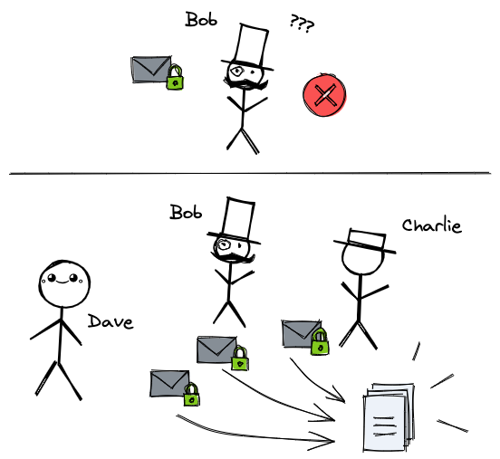
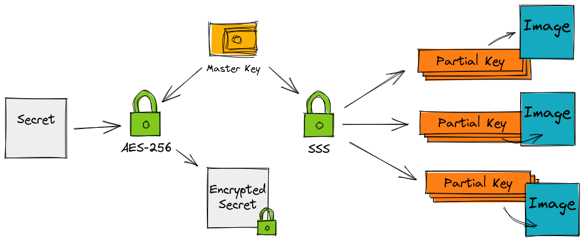
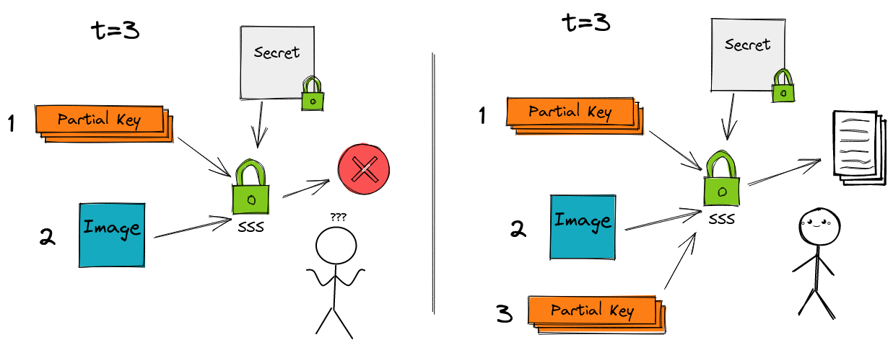

# StegoSecretS


[](https://github.com/enrichman/stegosecrets/actions)
[](https://github.com/enrichman/stegosecrets/actions)
[](https://goreportcard.com/report/github.com/enrichman/stegosecrets)
[](https://img.shields.io/codecov/c/github/enrichman/stegosecrets?logo=codecov)  
[](https://img.shields.io/github/license/enrichman/stegosecrets)
[](https://img.shields.io/github/go-mod/go-version/enrichman/stegosecrets)
[](https://img.shields.io/github/v/release/enrichman/stegosecrets)
[](https://godoc.org/github.com/enrichman/stegosecrets)


StegoSecretS combines [AES-256](https://en.wikipedia.org/wiki/Advanced_Encryption_Standard) encryption, [Shamir's Secret Sharing (SSS)](https://en.wikipedia.org/wiki/Shamir%27s_Secret_Sharing) and [steganography](https://en.wikipedia.org/wiki/Steganography)!

It helps you share a secret among other trusted peers, keeping a minimum threshold of keys to recover the original one.
The partial keys will also be hidden inside images, adding an additional layer of "security".

***Note:** the project is under active development. The APIs are subject to change!*

## Quickstart

### Installation

You can install the `stego` CLI with brew
```bash
brew install enrichman/tap/stegosecrets
```
or getting the [latest release](https://github.com/enrichman/stegosecrets/releases/latest), or building it from source.

### Encrypt / Decrypt

TLDR: go to the [usage](#usage) section for more details
```
stego encrypt --file mysecret.txt --parts 5 --threshold 3
```
```
stego decrypt --file mysecret.txt.enc --img 001.jpg --key 002.key --img 003.jpg
```

## How does it work?

Alice wants to protect her new "patent pending nuclear blender project" from EvilCompany.  
They want it, so she asks her friends Bob, Charlie and Dave to keep it safe.  
She trusts them, but to add an additional layer of security she emails them an encrypted file and an image of a cat containing a special key. 🐈


With this special key Bob alone is not able to decrypt the secret, so even if someone from EvilCompany gets the hands on his secret it will be useless. They will still need to get Charlie's and Dave's keys.



### Ok, but.. how does it work?

An input file (or message) will be encrypted using AES-256 with a crypto secure random 32 bit key. This key will be then split in `p` parts with Shamir's Secret Sharing algorithm (SSS).  
A `t` threshold of partial keys is needed to recover the original one and decrypt the secret.



For example, encrypting the file having 5 `parts` with a `threshold` of 3 will split the `master-key` into 5 pieces. These pieces will be also hidden into 5 images. To reconstruct the original master key at least 3 partial keys and/or images are needed.




## Usage

### encrypt

To encrypt a file you can explicit the filename:

```
stego encrypt --file mysecret.txt -p 5 -t 3
```

or you can write the message:
```
-> % stego encrypt -p 5 -t 3
Enter text: my secret message
```

This will generate (a lot) of files:

```
# out
mysecret.txt.checksum
mysecret.txt.enc
mysecret.txt.enc.checksum
mysecret.txt.key

001.jpg
001.jpg.checksum
001.key
002.jpg
002.jpg.checksum
002.key
...
005.jpg
005.jpg.checksum
005.key
```

Main files:
- `mysecret.txt.checksum` is the sha256 checksum of the `mysecret.txt` file (used to check a successful decryption)
- `mysecret.txt.enc` is the encrypted file
- `mysecret.txt.enc.checksum` is the sha256 checksum of the `mysecret.txt.enc`
- `mysecret.txt.key` is the master key used to encrypt/decrypt the secret

Partial files:
- `n.key` the `n` partial key
- `n.jpg` the `n` image where the `n` partial key is hidden
- `n.jpg.checksum` is the sha256 checksum of the `n.jpg` image

**Note*:* If no parts are specified the `master-key` will not be split. Keep it safely stored or delete it.  


Checksums can be used to check the integrity of the files:

```
-> % sha256sum --check mysecret.txt.enc.checksum
mysecret.txt.enc: OK
```

### decrypt

To decrypt a file just use enough keys and/or images:

```
stego decrypt --file mysecret.txt.enc --key 001.key --key 002.key --img 003.jpg
```

also the master key alone can be used to decrypt the file:

```
stego decrypt --file mysecret.txt.enc --master-key mysecret.txt.key
```


### images

To hide the partial keys with steganography you will need a folder with some images.  
To get some random images from https://picsum.photos/ the `images` command can be used. They will be stored in the `images` folder.

```
stego images
```
